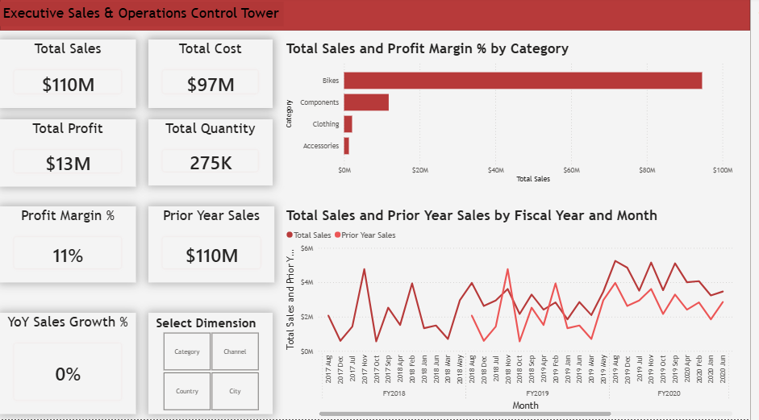

# 📊 Executive Sales & Operations Control Tower | Power BI

An executive-level, interactive Business Intelligence solution built on the **AdventureWorks Data Warehouse** dataset. This dashboard provides deep analytical insights into **$110M+ enterprise sales**, profitability margins, product line metrics, and time-intelligence comparisons.

---

## 📸 Executive Dashboard Preview

---

## 🎯 Business Problem & Solution

* **Challenge:** Decision-makers required a unified view of multi-channel sales performance, profitability margins, and historical year-over-year trends without navigating through fragmented reports.
* **Solution:** Engineered an end-to-end Power BI report featuring a centralized **Star Schema**, dynamic dimension switching using **Field Parameters**, dynamic **Report Page Tooltips**, and dedicated **DAX Time Intelligence** measures.

---

## 🛠️ Architecture & Technical Highlights

### 1. Data Cleaning & Transformation (Power Query ETL)
* Cleansed and standardized raw data streams across all 7 operational tables.
* Resolved data type mismatches (formatting keys as integer/text and financial metrics as fixed decimals/percentages).
* Preserved postal codes and numeric codes as text to retain leading zeroes and alpha-numeric integrity.

### 2. Data Modeling (Star Schema)
Designed an enterprise-grade Star Schema architecture centered around the `Sales` fact table connected via `1-to-Many (1:*)` single-directional relationships:
* **Fact Table:** `Sales`
* **Dimension Tables:** `Customer`, `Date`, `Product`, `Reseller`, `SalesOrder`, `SalesTerritory`
* **Dedicated Governance Table:** `_Key Measures` for centralized DAX measure management.

### 3. Advanced DAX & Time Intelligence
Key KPI metrics implemented using DAX:
* **Total Sales:** `SUM(Sales[Sales Amount])`
* **Total Profit:** `[Total Sales] - [Total Cost]`
* **Profit Margin %:** `DIVIDE([Total Profit], [Total Sales], 0)`
* **Prior Year Sales (PY):** `CALCULATE([Total Sales], SAMEPERIODLASTYEAR('Date'[Date]))`
* **YoY Sales Growth %:** `DIVIDE([Total Sales] - [PY Sales], [PY Sales], 0)`

### 4. Interactive UI/UX Design
* **Dynamic Slicing via Field Parameters:** Enabled users to dynamically slice visual dimensions across `Category`, `Country`, `Channel`, and `City`.
* **Report Page Tooltip (`TT_Details`):** Hovering over category bars seamlessly projects localized performance cards and profit margins.
* **Tile-style Slicers & Executive Layout:** Clean structure optimized for rapid managerial decision-making.

---

## 📊 Business Key Performance Indicators (KPIs)

| Metric | Enterprise Value |
| :--- | :--- |
| **Total Revenue** | **$110M** |
| **Total Cost** | **$97M** |
| **Net Profit** | **$13M** |
| **Profit Margin %** | **11%** |
| **Total Order Quantity** | **275K Units** |

---

## 🛡️ License

This project is licensed under the MIT License. You are free to use, modify, and share this project with proper attribution.

## 🌟 About Me

Hi there! I'm Ahmed Alnaggar. I'm a data analyst.

